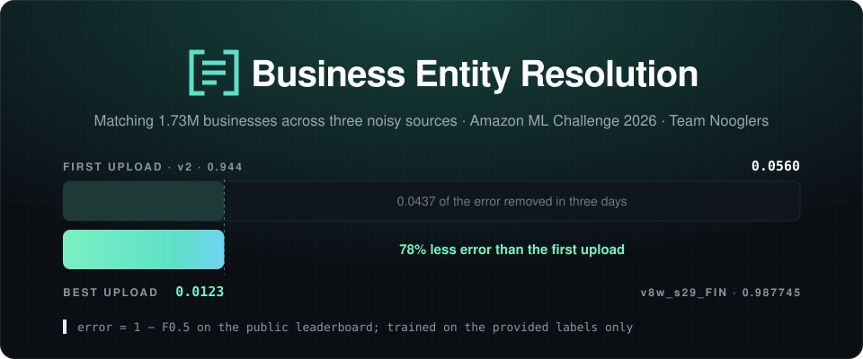
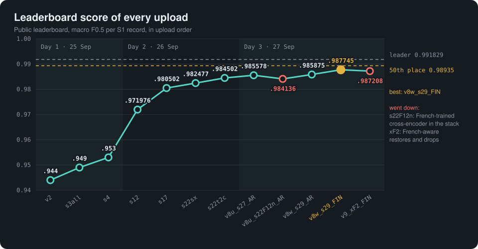
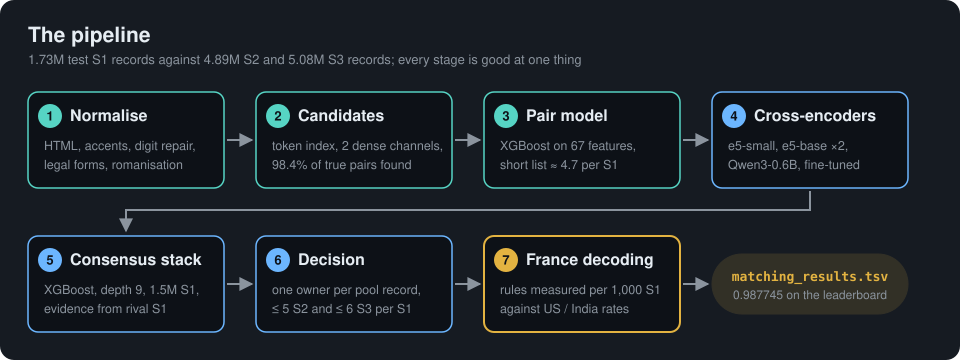

<p align="center">
  
</p>

<p align="center">
   
</p>
<p align="center">
  
  
  
  
  
  
  
</p>

For every business record in Source 1 (S1), the task is to find the records in Source 2 and Source 3 (S2, S3) that describe the same business.
Our solution has several stages:
- candidate generation, first from a token index and then from two dense retrieval channels;
- an XGBoost pair model;
- fine-tuned multilingual cross-encoders;
- a consensus stack that weighs the evidence from competing records;
- a decoding step for France, the one country with no training data.

Everything was built in three days (25 to 27 September 2026, IST) from the provided training data only.

| | |
|---|---|
| Best leaderboard score | **0.987745** (`v8w_s29_FIN`, 27 Sep) |
| Locked holdout (US and India), first model → best stack | 0.9565 → 0.99088 |
| France F0.5 (estimated from leaderboard probes) | about 0.92 (day 2) → about 0.977 (`v8w_s29_FIN`) |

The full story, version by version, is in **[docs/build-log.md](docs/build-log.md)**.

<p align="center">
  
</p>
<p align="center"><sub>Two diagnostic uploads on 26 Sep (France only 0.187, US only 0.453) are left out: they were country probes, not candidate solutions.</sub></p>

---

## 1. The task

- **Input:** 1.73M test S1 records against 4.89M S2 and 5.08M S3 records, all noisy.
  - The noise includes typos, digit-for-letter swaps, dropped or reordered words, legal-form variants, "doing business as" aliases, missing addresses and non-Latin scripts.
  - Training has 2.21M labelled S1.
- **Output:**
  - `matching_results.tsv`: the matches of every S1;
  - `candidate_pairs.tsv`: the candidate set that was scored.
- **Metric:** F0.5 per S1, averaged, so precision counts four times as much as recall.
  - An S1 with no true match scores 1 only if its list is empty.
- **Structure found in the data:**
  - each S1 has at most 5 S2 and 6 S3 matches;
  - every pool record belongs to at most one S1;
  - 5.6% of S1 have no match.
- **The catch:** the test mix is US 38%, India 47%, France 15%, and **France has no records in training at all**. France turned out to be the largest source of lost score.
- **Rules:** open models under MIT or Apache-2.0 with at most 8B parameters, no external data or lookups, five leaderboard uploads a day.

## 2. The final pipeline

<p align="center">
  
</p>

| Stage | What it does | Code |
|---|---|---|
| 1. Normalise | HTML entities, accents, digit-for-letter repair, alias and legal-form fields, romanisation of non-Latin names | `ber/stages/prepare.py`, `ber/text.py` |
| 2. Candidates | Weighted token index in DuckDB (100 per S1, pruned to 30 by a learned ranker), plus two dense channels from a fine-tuned `multilingual-e5-small`: one over names, one over "name \| address". 98.4% of true pairs are found. | `block.py`, `prune.py`, `dense.py`, `dense_all.py` |
| 3. Pair model | XGBoost on 67 features: similarity, rarity, digits, legal forms, competition between S1. Keeps about 4.7 candidates per S1, the submitted candidate file. | `pairs.py`, `train_gpu.py`, `score_rest.py` |
| 4. Cross-encoders | Models that read both records together: e5-small, e5-base (symmetric, two seeds averaged) and Qwen3-0.6B, fine-tuned on training pairs | `xenc.py`, `xenc_fr.py` |
| 5. Consensus stack | Second XGBoost (depth 9, 1.5M S1) over the cross-encoder scores and evidence from the S1's other candidates and from rival S1 | `stack.py` |
| 6. Decision | Each pool record goes to at most one S1, an F0.5-tuned threshold, at most 5 S2 and 6 S3 matches per S1 | `predict.py`, `decision.py` |
| 7. France decoding | Rules for the unlabelled country, each backed by a measurement (see below) | `src/scripts/france/` |

**France decoding.** Every rule was accepted only when France kept far more pairs of that kind per 1,000 S1 than the US and India do. On the labelled holdout those kinds are 99%+ true, so a large French excess is decoys.
- Sibling decoys that swap the business-type word, from a learned vocabulary of 43 words (`nje ecole` against `nje centre`).
- Legal-form conflicts (`SARL` against `SAS`).
- Namesakes on another street.
- A 0.9999 cut-off for France's over-confident probabilities, with exceptions for French copy forms: noise words (`fils`, `groupe`, `et associes`), initials, spaced legal forms (`s a r l`) and glued names.
- Re-adding unowned copies at the S1's own address.

The leaderboard gave a break-even point: a French rule helps when more than 26% of what it drops is wrong.

## 3. How we got there

| Version | Day | Main change | Holdout | Leaderboard |
|---|---|---|---|---|
| `v0` | 1 | Token blocking and XGBoost, 42 features | 0.9377* | – |
| `v2` | 1 | Cascade blocking with a learned pruner, locked 150k-S1 holdout | 0.9565 | 0.944 |
| `s1`–`s4` | 1 | Consensus stack, dense name channel | 0.9708 | 0.953 |
| `s6` | 1–2 | Name-and-address dense channel, short list | 0.9832 | – |
| `s12` | 2 | Decoy features, 1.5M S1, deeper stack | 0.98505 | 0.971976 |
| `s17` | 2 | Cross-encoders (e5-small and e5-base) | 0.99025 | 0.980502 |
| `s22sx`, `s22t2c` | 2 | First France rules: word swap, type swaps, French threshold, caps | 0.99054 | 0.984502 |
| `v8u_s27_AR` | 3 | Symmetric cross-encoder, France cut-off with protections | 0.99063 | 0.985578 |
| `v8w_s29_AR` | 3 | Qwen3-0.6B cross-encoder | 0.99088 | 0.985875 |
| **`v8w_s29_FIN`** | 3 | France rules measured per 1,000 S1 (type words, legal forms, namesakes, 0.9999 cut, alias fix) | 0.99088 | **0.987745** |
| `v9_xF2_FIN` | 3 | French-aware cross-encoder restores and drops on `s28` | 0.990770 | 0.987208 |
| `v9_s30F_FIN` | after close | Stack `s30F` with the French-aware cross-encoder as a feature | 0.990776 | not uploaded |

\* Out-of-fold on the training sample. The holdout covers only the US and India, because training has no French records.

**Turning points**
- **Day 1: recall first.** The first loss analysis showed that candidate generation capped the score at 0.978. The learned pruner and the two dense channels moved the holdout from 0.9565 to 0.9832.
- **Day 2: cross-encoders.** These were the biggest modelling gain, and the one that transferred best to the test.
  - Two diagnostic uploads (France only, US only) then showed that the US and India were at about 0.99 but France only at about 0.92.
  - The focus moved to France.
- **Day 3: measure France without labels.** Comparing France's pairs per 1,000 S1 with the US/India rates replaced a biased estimate and gave the FIN rules, our best score.
  - A French-rewritten copy of the holdout (training records rewritten in French form, labels kept) then measured the real cause: the cross-encoder's average precision fell from 0.9993 to 0.9710 on French-form names.
- **After the window closed.** An e5-base cross-encoder trained on original plus French-rewritten training pairs (`xencFZ`) scores 0.9992 average precision on the French-rewritten pairs.
  - The stack built on it (`s30F`) raises the French-rewritten holdout from 0.976026 (`s28`) to **0.986655**, with the US/India holdout unchanged (0.990776).
  - Its file `v9_s30F_FIN` passes the official validator but could not be uploaded.
  - A caution: `v9_xF2_FIN`, which used the same cross-encoder for restores and drops on top of the FIN rules, scored 0.987208 on the leaderboard, below the best. Gains on the French-rewritten holdout did not fully carry over to the real French records.

**Tried and dropped:**
- per-country and rank-dependent thresholds;
- sub-group recalibration;
- matching "twin" names between pool records;
- raw spelling before normalisation;
- a French cross-encoder trained on synthetic pairs (it cost 0.0014 on the leaderboard);
- self-training on French pseudo-labels (it only reproduced the existing rules).

Training uses only the provided labels.

## 4. Repository layout

```
.
├── README.md                  this file
├── src/
│   ├── ber/                   the pipeline package: text normalisation, config, decision, split, tracking, validation
│   │   └── stages/            prepare, sample, block, prune, dense, dense_all, pairs, train_gpu, score_rest,
│   │                          xenc, xenc_fr, stack, predict
│   ├── scripts/france/        France decoding and French adaptation (france_variants.py, france_lists.py,
│   │                          frenchify.py, stack_langfree.py, xfz*.py and their helpers)
│   ├── scripts/stack/         score and stack tools (avg_xenc.py, xs_merge.py, blend_stacks.py, paired_models.py, ...)
│   ├── scripts/check_submission.py
│   └── tests/                 unit and end-to-end tests
├── configs/params.yaml        every tunable
├── Makefile                   stage targets with hash-based caching, `make test`
├── reproduce_final.sh         the exact command sequence of the submitted model
├── requirements.txt           CPU environment; requirements-gpu.txt for the torch steps
├── aws/
│   ├── sm/                    job client: publish code, enqueue jobs, follow logs (sm.py)
│   └── queue/                 SageMaker notebook job runner (GPU and CPU lanes) and the build jobs
├── docs/
│   ├── build-log.md           the full three-day story
│   ├── pipeline.md            the pipeline in detail: stages, France decoding, reproduction, licences
│   ├── assets/                README figures (banner, leaderboard chart, pipeline diagram)
│   ├── handoffs/              handoff notes between sessions and teammates
│   └── archive/               plans, architecture notes and handoffs of earlier versions
├── data/                      place for the challenge dataset (not committed)
└── output/                    downloaded submission files (git-ignored)
```

## 5. Reproducing

[docs/pipeline.md](docs/pipeline.md) gives the requirements, the environment setup and the checks. In short, from the repository root:

```bash
pip install -r requirements.txt            # plus requirements-gpu.txt in a second environment for the torch steps
export BER_DATA=/path/to/dataset BER_WORK=/path/to/work
TORCH_PYTHON=/path/to/gpu-env/bin/python bash reproduce_final.sh
```

`reproduce_final.sh` rebuilds the submitted file `v8w_s29_FIN` (stack `s29` with the final France decoding) into `$BER_WORK/output/final/`; the
`s28` variant `v8u_s28_FIN` is built on the way. Expect about 6 hours on 64 vCPU and one A10G GPU.

On AWS, the same steps ran as queued jobs on a SageMaker notebook: `python aws/sm/sm.py publish`, then `python aws/sm/sm.py enqueue aws/queue/jobs/<job>.sh`.

The jobs kept in `aws/queue/jobs/` are:
- the FIN build: `v8h5_fin`;
- delivery: `v8w_deliver`;
- the v9 chain: `v9a2_frenchify` (French-rewritten training copy), `v9a4_xfz` (French-aware cross-encoder), `v9a6_scoreFZ` (scoring) and `v9a7_s30F` (stack, holdout tests, final file).

## 6. Documents

| Document | What it holds |
|---|---|
| `docs/build-log.md` | Every version, every leaderboard reading, why each step was taken, what we learned |
| `docs/pipeline.md` | The pipeline in detail: every stage, the France decoding rules, reproduction, holdout results, licences |
| `docs/handoffs/v8-france-handoff.md` | State of the France work on day 3 (v8 recipe, delivered files, open questions) |
| `docs/handoffs/team-handoff.md` | The team's running handoff: infrastructure, status, data facts |
| `docs/handoffs/team-aws-handoff.md` | Handoff for teammates continuing on their own AWS accounts |
| `docs/archive/architecture-reference.md` | Architecture reference up to `s17`–`s22`, with component details |
| `docs/archive/experiments-registry.md` | Registry of experiments and runs |
| `docs/archive/research-notes.md` | Measurements and research notes |
| `docs/archive/implementation-context.md` | Data facts and infrastructure context |
| `docs/archive/team-guide.md` | How the team trained and ran jobs |
| `docs/archive/submission-checklist.md` | Rules from the problem statement and guidelines |
| `docs/archive/v1-…` to `v8-…` | Plans, architecture notes, handoffs and build notes of each earlier version |

Some documents still mention files by their old names:

| Old name | New name |
|---|---|
| `code/business_entity_resolution/` (`src/`, `configs/`, `Makefile`, `reproduce_final.sh`, requirements) | the repository root |
| `code/business_entity_resolution/README.md` | `docs/pipeline.md` |
| `src/scripts/<name>.py` (France and stack scripts) | `src/scripts/france/<name>.py`, `src/scripts/stack/<name>.py` |
| `NOOGLERS_BUILD_LOG.md` | `docs/build-log.md` |
| `handoff.md` | `docs/handoffs/team-handoff.md` |
| `TEAMMATE_HANDOFF.md` | `docs/handoffs/team-aws-handoff.md` |
| `HANDOFF-v8_barani.md` | `docs/handoffs/v8-france-handoff.md` |
| `ARCHITECTURE.md` | `docs/archive/architecture-reference.md` |
| `EXPERIMENTS.md` | `docs/archive/experiments-registry.md` |
| `research.md` | `docs/archive/research-notes.md` |
| `context.md` | `docs/archive/implementation-context.md` |
| `TEAM_GUIDE.md` | `docs/archive/team-guide.md` |
| `submission_checklist.md` | `docs/archive/submission-checklist.md` |
| `understanding.md` | `docs/archive/problem-and-data-overview.md` |
| `plan.md` | `docs/archive/v1-plan.md` |
| `v1.md`, `v2.md`, `research-v2.md` | `docs/archive/v1-record-centric-assignment.md`, `v2-plan-of-record.md`, `v2-research.md` |
| `HANDOFF-v2_barani.md`, `HANDOFF-v4_roshan.md`, `HANDOFF-v7_barani.md` | `docs/archive/v2-handoff.md`, `v4-handoff.md`, `v7-france-handoff.md` |
| `ARCHITECTURE_v4.md`, `ARCHITECTURE_v5.md`, `v5.md` | `docs/archive/v4-architecture.md`, `v5-architecture.md`, `architecture-reference-draft.md` |
| `S29_FIN_BUILD_barani.md`, `V8_FILES_barani.md` | `docs/archive/v8-s29-fin-build.md`, `v8-portal-files.md` |
| `remote-setup.md` | `docs/archive/sagemaker-ssh-setup.md` |

## 7. Models and licences

- XGBoost (Apache-2.0).
- `intfloat/multilingual-e5-small` and `-base` (MIT; 118M and 278M parameters).
- `Qwen/Qwen3-0.6B` (Apache-2.0).
- The libraries are numpy, pandas, scikit-learn, polars, duckdb, rapidfuzz, anyascii, torch and transformers, all under MIT, BSD, ISC or Apache licences.

Every model is far below the 8B limit. No external data or lookups are used. The legal-form, abbreviation and French-rewrite tables are hand-written string rules.
