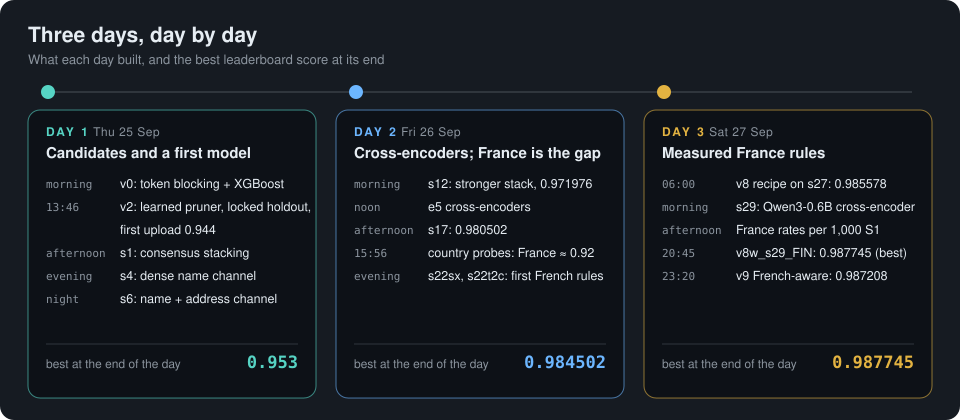
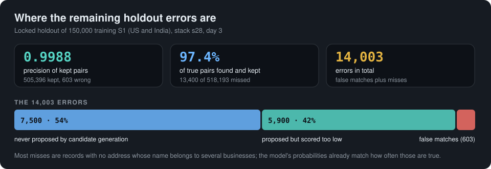
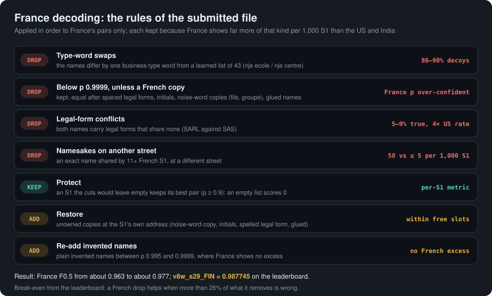
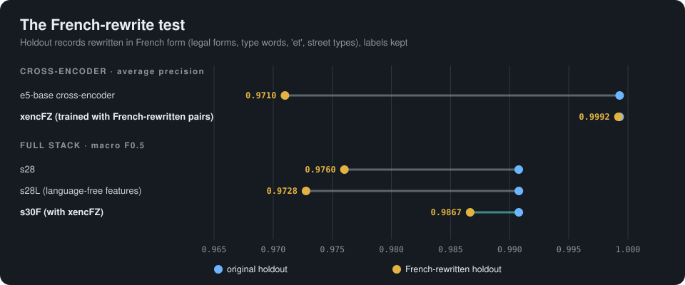
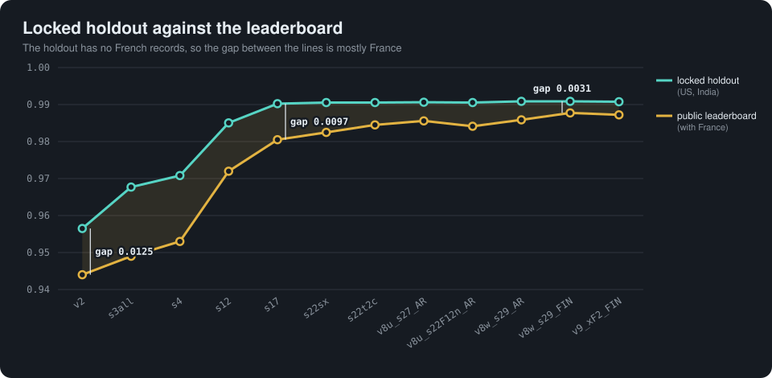

# Nooglers Build Log

**Amazon ML Challenge 2026 · Business Entity Resolution · Team Nooglers**
How the solution was built over the three days of the challenge (25 to 27 September 2026, IST): each version, why it replaced the one before,
and what the leaderboard said about it. Written 28 Sep 2026, just after the window closed. All scores are macro F0.5 per Source 1 (S1) record.

| | |
|---|---|
| First leaderboard score | **0.944** (`v2`, 25 Sep 13:46) |
| Best leaderboard score | **0.987745** (`v8w_s29_FIN`, 27 Sep about 20:45) |
| Locked holdout, first model to best stack | **0.9565 → 0.99088** (`v2` → `s29`) |
| 50th place on the public board at the close | 0.98935 |

---

## 1. The task and the rules we worked under

For every S1 business record, list the records in two other sources (S2, S3) that describe the same business. The score is F0.5 computed per S1
and averaged. Precision counts four times as much as recall. An S1 with no true match scores 1 only if its list is empty; an S1 with matches
scores 0 if its list is empty.

What the data showed on day 1, and what shaped every later decision:

- **Scale:** train 2.21M S1 against 5.03M S2 and 5.29M S3 records; test 1.73M S1 against 4.89M and 5.08M. Candidate generation had to be
  designed before any matcher.
- **Structure:** 5.6% of S1 have no match; the mean is 3.46 matches per S1, never more than 5 from S2 and 6 from S3; every S2/S3 record belongs
  to at most one S1; about 27% of training pool records (41% on the test) belong to none.
- **Noise:** typos, digit-for-letter swaps, dropped and reordered words, legal-form variants, "doing business as" aliases, invented brand names
  at the same address, missing addresses, glued words, non-Latin scripts for about 9% of Indian names.
- **Test mix:** US 38.3%, India 46.8%, France 15.0% of S1. **France has no records at all in training.** It turned out to be the single largest
  source of lost score.

Constraints: open models under MIT or Apache-2.0 with at most 8B parameters, no external data or lookups, five leaderboard uploads per day.
Models were trained only on the provided training data. The organisers' public Q&A later confirmed that the private leaderboard scores each
team's **best** public submission, and that unsupervised use of the test records was allowed; we did not rely on the latter.

---

## 2. Every leaderboard score, in upload order

| # | Day | File | Leaderboard | Change |
|---|---|---|---|---|
| 1 | 25 Sep 13:46 | `v2` | 0.944 | first upload |
| 2 | 25 Sep | `s3all` | 0.949 | +0.005 |
| 3 | 25 Sep | `s4` | 0.953 | +0.004 |
| 4 | 26 Sep | `s12` | 0.971976 (rank 402) | +0.019 |
| 5 | 26 Sep | `s17` | 0.980502 | +0.0085 |
| – | 26 Sep 15:56 / 15:57 | `s17pf` / `s17pu` | 0.187 / 0.453 | country probes (France only / US only), diagnostic |
| 6 | 26 Sep, last slot | `s22sx` | 0.982477 | +0.0020 |
| 7 | 26 Sep evening | `s22t2c` | 0.984502 | +0.0020 |
| 8 | 27 Sep 06:00 | `v8u_s27_AR` | 0.985578 | +0.0011 |
| 9 | 27 Sep 06:15 | `v8u_s22F12n_AR` | 0.984136 | −0.0014 (the one step down) |
| 10 | 27 Sep | `v8w_s29_AR` | 0.985875 | +0.0003 |
| 11 | 27 Sep about 20:45 | **`v8w_s29_FIN`** | **0.987745** | +0.0019 (best) |
| 12 | 27 Sep (last slot) | `v9_xF2_FIN` | 0.987208 | −0.0005 (below the best) |

The two country probes (France only 0.187, US only 0.453) are left out of the chart.

---

## 3. The architecture that emerged

By the end, the solution was a cascade in which each stage only has to be good at one thing:

1. **Candidate generation.** A weighted token index over all pool records (name words, address words, numbers, 5-character prefixes, composite
   keys), 100 candidates per S1 pruned to 30 by a learned ranker, plus two dense retrieval channels from a fine-tuned multilingual encoder
   (`multilingual-e5-small`): names only for non-Latin text, and "name | address" for every record.
2. **First-stage pair model.** XGBoost on 67 similarity, rarity, digit, legal-form and competition features. It keeps a short list of about 4.7
   candidates per S1; that short list is the submitted `candidate_pairs.tsv` (8.2M pairs on the test).
3. **Cross-encoders.** Multilingual transformers that read both records of a pair together: e5-small, e5-base (plain and symmetric with two
   seeds) and Qwen3-0.6B, all fine-tuned on training pairs.
4. **Consensus stack.** A second XGBoost (depth 9, 1.5M S1) combining those scores with evidence from the S1's other candidates and from other
   S1 that claim the same record.
5. **Decision.** Each pool record goes to at most one S1; one F0.5-tuned threshold; at most 5 S2 and 6 S3 matches per S1.
6. **France decoding.** Rules for the unlabelled country, each backed by measured evidence, applied after the model
   (`src/scripts/france/france_variants.py`, `france_lists.py`).

---

## 4. Day 1 (Thu 25 Sep): candidates, a first model, and relative evidence

### `v0` baseline (morning)
Token blocking (30 candidates per S1) and an XGBoost model on 42 string-similarity features, with exclusive assignment of each pool record to
its best S1. **Out-of-fold 0.9377.**

*Why the next step:* the loss analysis showed the candidate lists already capped the score at 0.9781 (blocking cost 0.022), and the matcher
lost another 0.040, mostly through missed matches. Recall was the problem, not precision.

### `v1` richer features (late morning)
63 features: name rarity, exact core-name flag, token coverage, glued-name similarity, digit alignment, romanised names for non-Latin text
(anyascii), consonant skeletons. India improved most (0.905 → 0.935). **Out-of-fold 0.9551.**

### `v2` cascade blocking (13:46, first upload)
100 raw candidates per S1, pruned to 30 by a learned ranker (candidate recall 0.9415 → 0.9471). A **locked holdout of 150,000 training S1** was
set aside here and used for every later decision. **Holdout 0.9565, leaderboard 0.944.**

*Why it mattered:* the holdout-to-leaderboard gap (0.0125) was the first sign that the test differs from training. We suspected France but
could not yet measure it.

### `s1` consensus stacking (afternoon)
A second-stage model that sees relative evidence: how strongly other S1 claim the same record, the margin to the best competing S1, how many
confident records an S1 already has per source. **Holdout 0.9617 (+0.0051).**

Rejected the same afternoon: probability calibration with an exact expected-F0.5 decision per S1 (`expf`: +0.0001, not significant). The
threshold was already near optimal.

### `s3all` and `s4` dense name channel (evening)
`s3all` added digit, house-number and TF-IDF consensus features to the stack. `s4` added a multilingual e5-small encoder fine-tuned on true
pairs to retrieve non-Latin names (their recall 75.9% → 85.3%). **Holdout 0.9677 and 0.9708; leaderboard 0.949 and 0.953.**

### `v5`, `s5`, `s6` name-and-address dense channel (night, into 26 Sep 02:00)
A second dense channel over "name | address" for every record (each pool record proposes its nearest S1) recovered 66% of the blocking misses.
`s6` introduced the short list (4.9 candidates per S1 instead of 31), shrinking the candidate file while keeping recall. **Holdout 0.9832.**

---

## 5. Day 2 (Fri 26 Sep): cross-encoders, and discovering that France is the gap

### `s8` to `s12` a stronger stack (morning)
Edit-type "decoy" features for look-alike names, more carried columns, 1.5M S1 of training data for the stack instead of 400k, depth 9.
**Holdout 0.98505; leaderboard 0.971976 (rank 402).**

### `s11` to `s16` cross-encoders (morning to noon)
The biggest single modelling gain of the challenge: a fine-tuned multilingual e5-small that reads both records together (+0.0053 on the
holdout), then e5-base on 966k pairs, then a first stage retrained on 850k S1 (`v7`). **Holdout 0.98887 → 0.98946.**

*Why it mattered:* hand-made similarities only approximate name noise; a model that reads both records jointly captured most of what they
missed. It also transferred best to the test: each cross-encoder step moved the leaderboard about 1.7 times as much as the holdout.

### `s17` combined cross-encoders (early afternoon)
`v7` first stage, e5-base re-scored on its uncertain band, e5-small as a second feature, refined competition features.
**Holdout 0.99025; leaderboard 0.980502.**

Checks that followed:
- **Adversarial validation** (AUC 0.87): driven by set-size artefacts (blocking scores, candidate counts), not by harder records.
- **Recall audit of every true pair:** 97.3% found; the missed ones are mostly pool records with no address whose name belongs to several
  businesses.
- **`s22`:** the cross-encoder on every short-listed pair, +0.00029 (holdout 0.99054).

### Country probes: France is the gap (15:56 and 15:57)
Two diagnostic uploads with only France (or only US) predictions filled in scored **0.187** and **0.453**. Solved together with the `s17` score,
they put US and India at about 0.99, the same as the holdout, and **France at about 0.92 to 0.93**.

*Why it redirected everything:* France has no labels and a different data generator. Names are a city or brand plus a type word
(`bordeaux club`; 530 S1 share that exact name), legal forms are spelled out (`s a r l`), names appear as initials or glued, up to 101
businesses share one address, and its decoys are sister businesses whose name swaps the type word (`nje ecole` against `nje centre`).

### `s22sx` the word-swap rule (evening, last slot of the day)
Drop French pairs whose names differ by one swapped common word when the S1 already has an exact-name copy. **Leaderboard 0.982477.**

This upload also calibrated how to read the leaderboard: every variant is scored on the same public S1, so the difference between two uploads
measures exactly the pairs that differ. Dropping 1% of France's pairs moves France F0.5 by **+0.0063 if they are wrong** and **−0.0022 if they
are true**, so a French rule helps when **more than 26%** of what it drops is wrong.

### A label-free instrument and a ruled-out alternative (evening)
- **Slot occupancy:** an S1 holds at most 5 S2 and 6 S3 copies, so a true copy must fit into a free slot while a decoy does not care.
  Comparing how often a kind of pair appears at full versus empty S1 estimates its decoy share without labels. This learned the French
  type-word vocabulary.
- **Could the US and India test be harder instead?** A training universe rebuilt to match the test's distractor density cost only 0.0007, so
  France really holds the gap.

### `s22t2c` type swaps, a French threshold, caps (evening)
The learned type-word swap rule, a French probability threshold of 0.985 (French probabilities were over-confident well into the 0.9s), and
the 5 S2 / 6 S3 cap per S1. **Leaderboard 0.984502.**

In parallel on Day 2, a separate line (v4 to v7 on our own AWS notebook) explored alternative blocking, a stronger encoder and French
vocabulary; its best model reached a holdout of 0.98920 but was never uploaded, and its useful parts fed into Day 3. The team's shared compute
credits ran out at about 22:45; work continued on our own AWS notebook (ml.g5.16xlarge).

---

## 6. Day 3 (Sat 27 Sep): French decoding, better bases, and a French-aware model

### v8 French decoding recipe (00:00 to 05:00)
- **Protected cut-off (0.995):** drop French pairs below 0.995 unless the names are equal after joining spaced legal forms, are initials of the
  S1, or differ only by French noise words (`fils`, `groupe`, `services`, `developpement`).
- **Protect:** an S1 the cut would leave empty keeps its best pair (an empty list scores 0 when a match exists).
- **Restore:** unowned candidates at the S1's own address that are French copy forms (noise-word copies, initials, spelled legal forms, glued
  names) are added within the S1's free slots.

### `v8u_s27_AR` up, `v8u_s22F12n_AR` down (06:00 and 06:15)
The recipe on `s27` (symmetric e5-base cross-encoder, two seeds, holdout 0.99063) reached a new best: **0.985578**. The same recipe with a
French-trained cross-encoder inside the stack fell to **0.984136**.

*Lesson:* that French cross-encoder had been trained on synthetic French-style pairs; it learned to reject real French copies, costing about
0.009 of France F0.5. French training data must keep the real structure of copies and decoys.

### `s28`, `s29` Qwen as a cross-encoder (morning)
A fine-tuned Qwen3-0.6B cross-encoder added to the stack (`s28`, +0.000135 over `s27`), then placed in the slot of the weaker e5-small score
(`s29`, built by a teammate's session, +0.00025 over `s27`). **Holdout 0.990770 and 0.99088; leaderboard 0.985875 (`v8w_s29_AR`).**

### Where the remaining loss is (11:00 to 14:00)
A full error budget of the holdout: 505,396 kept pairs with only 603 wrong (precision 0.9988), and 13,400 missed true pairs (7,500 never
proposed, 5,900 scored too low). The misses are mostly records with no address whose name is shared by several S1; the model's probabilities
already match how often those are true, so US and India were effectively at their limit.

Tests that came back null (do not repeat): per-country and rank-dependent thresholds, a US/India threshold of 0.80, sub-group recalibration,
name "twins" between pool records, raw spelling before normalisation, row order and ID leaks, recovering exact-name records outside the
candidate lists.

### A better measure for France, and the FIN rules (12:00 to 18:00)
The slot-occupancy estimate proved biased at the level of single pair kinds: it read 40% to 100% decoys for US and Indian kinds that are 99.9%
true on the holdout. It was replaced by a direct comparison: **how many pairs of a kind France keeps per 1,000 S1, against the US and India
rates**, where the labelled holdout shows those kinds are true. A large French excess is decoys. Four research agents ran in parallel on it.
Result, the FIN rules:

- **43 learned type words** instead of 30 (`lycee`, `pharmacie`, `danse`, `institut`, ...): 1,382 more sibling pairs at an 86% to 90% decoy
  share.
- **Legal-form siblings:** both names carry legal forms that share none (`SARL` against `SAS`); such candidates are 5% to 9% true on the
  US/India holdout, and France kept four times the US rate.
- **Namesakes on another street:** an exact name shared by 11 or more French S1, at a different street, below p 0.9999: France 58 per 1,000 S1
  against at most 5 for the US and India (about 93% decoys).
- **A stricter cut at 0.9999**, while re-adding plain invented names between 0.995 and 0.9999, where France shows no excess over the US.
- **Alias protection:** a bug fix; pool records written "Xyz Co DBA <S1 name>" had been dropped as legal-form conflicts.

### `v8w_s29_FIN` best score (about 20:45)
The FIN rules on `s29`. France moved from about 0.963 to about 0.977. **Leaderboard 0.987745.**

### Architecture experiments (15:00 to 20:00)
- **`s28L`, language-independent features:** word document frequencies per country, pool-to-S1 frequency ratios of swapped words, legal-form
  conflicts, namesake counts, invented-name flags. Neutral on the holdout (0.990781); the model itself started rejecting French siblings.
- **`s28T`, a transfer-only stack** without the cross-encoder scores for France: fixed French legal-form siblings entirely and halved type-word
  siblings, but kept more invented-name decoys (file `v8u_s28M_FIN`, not uploaded).
- **Self-training on French pseudo-labels:** reproduced the existing rules and lost address-noisy copies; dropped, and training was kept to the
  provided labels only.

### v9: a French-aware cross-encoder from training data (20:30 to 23:20)
The root cause was measured with labels: the locked holdout's records were rewritten in French form by `frenchify.py` (legal forms, category
words moved to the front, `and` → `et`, French street types, region against department names), keeping their labels. On those pairs:

| Model | Original holdout | French-rewritten holdout |
|---|---|---|
| e5-base cross-encoder (average precision) | 0.9993 | 0.9710 |
| full `s28` stack (macro F0.5) | 0.990770 | 0.976026 (close to our real French level of about 0.977) |
| **new `xencFZ` cross-encoder** (average precision) | **0.9993** | **0.9992** |

`xencFZ` is an e5-base trained on 400,000 original and 600,000 French-rewritten **training** pairs (58 minutes on one A10G).

Built for the last slot: **`v9_xF2_FIN`**, the FIN rules on `s28` plus two calibrated steps from the new model:
- restore 16,073 French copies it scores above 0.95 (97.8% true on the French-rewritten holdout);
- drop 7,516 pairs where a type word was replaced by a noise word (`lille theatre sarl` / `lille sarl and associes`).

It passed the official validator at 23:20 and scored **0.987208**, 0.000537 below `v8w_s29_FIN`. It was built on `s28` instead of `s29`,
which explains only a small part of that (`s29` is 0.00011 above `s28` on the holdout). So the two French-aware steps did not add score on
the real French records: the French-rewritten holdout overstated how well they transfer.

---

## 7. Every version and what it changed

| Version | Day | What changed | Why | Holdout | Leaderboard |
|---|---|---|---|---|---|
| `v0` | 1 | Token blocking + XGBoost, 42 features | Baseline | 0.9377* | – |
| `v1` | 1 | 63 features (rarity, glue, digits, romanisation) | Matcher recall | 0.9551* | – |
| `v2` | 1 | Cascade blocking, learned pruner | Candidate recall | 0.9565 | 0.944 |
| `s1`–`s3all` | 1 | Consensus stack | Relative evidence | 0.9677 | 0.949 |
| `s4` | 1 | Dense name channel (e5-small) | Non-Latin recall | 0.9708 | 0.953 |
| `s5`/`s6` | 1–2 | Name + address dense channel, short list | Blocking misses | 0.9832 | – |
| `s12` | 2 | Decoy features, 1.5M S1, depth 9 | Look-alikes | 0.98505 | 0.971976 |
| `s11`–`s16` | 2 | Cross-encoders (e5-small, e5-base), `v7` | Name noise | 0.98946 | – |
| `s17` | 2 | Combined cross-encoders | Best stack | 0.99025 | 0.980502 |
| `s22sx` | 2 | `s22` + word-swap rule | French siblings | 0.99054 | 0.982477 |
| `s22t2c` | 2 | Type swaps + French threshold 0.985 + caps | French over-confidence | 0.99054 | 0.984502 |
| `v8u_s27_AR` | 3 | `s27` + protected cut, protect, restore | French copies kept | 0.99063 | 0.985578 |
| `v8u_s22F12n_AR` | 3 | French cross-encoder in the stack | Test (failed) | 0.99054 | 0.984136 |
| `v8w_s29_AR` | 3 | `s29` (Qwen) + same recipe | Stronger base | 0.99088 | 0.985875 |
| **`v8w_s29_FIN`** | 3 | FIN rules (43 type words, legal forms, namesakes, 0.9999 cut, re-adds, alias fix) | Rate-measured French decoys | 0.99088 | **0.987745** |
| `v9_xF2_FIN` | 3 | FIN on `s28` + French-aware cross-encoder restores and drops | French reading ability | 0.990770 | 0.987208 |

\* out-of-fold on the training sample; later rows use the locked 150,000-S1 holdout. Holdout scores cover only the US and India, because
training has no French records.

---

## 8. What we learned

**What worked**
- Relative evidence: whether another S1 explains the same record better was the first large gain.
- Recall before precision: two dense channels and the learned pruner mattered more than matcher tuning early on.
- Cross-encoders: reading both records together was the biggest modelling gain and the one that transferred best to the test.
- Country probes: two diagnostic uploads located the gap precisely and redirected the last day and a half.
- Leaderboard differences as exact measurements, with a break-even share of wrong pairs (26%) for every French rule.

**What we would do differently**
- Measure France from day 1: the per-1,000-S1 comparison and the French-rewritten holdout only arrived on the last day.
- Build language-independent evidence into the model early instead of patching French errors with rules afterwards.
- Spend daily uploads on French decisions sooner; late-stage holdout gains on US and India moved the leaderboard far less.
- Keep the compute budget on one account from the start; the handover at the credit limit cost time on Day 3.

---

## 9. After the window closed

The full version of the French-aware approach finished at 00:40 on 28 Sep: stack `s30F`, with the new cross-encoder score built in as a
feature and trained on the US/India labels.

| Stack | Original holdout | French-rewritten holdout |
|---|---|---|
| `s28` | 0.990770 | 0.976026 |
| `s28L` (language-free features) | 0.990781 | 0.972780 |
| **`s30F`** | 0.990776 | **0.986655** |

Its file `v9_s30F_FIN` (the FIN rules on `s30F`) passed the official validator but could not be uploaded. `v9_xF2_FIN`'s result is a
caution for it: gains on the French-rewritten holdout did not fully carry over to the real French records.

---

## 10. Where the files are

- **Submission files** (both TSVs per run): team folder `s3://ml-challenge-nooglers/ml-challenge-2026/handoff-nooglers-20260926/runs/<name>/output/`
  for every version above (`v0` to `v9_xF2_FIN`, including `v8w_s29_FIN`); our runs also in `s3://sagemaker-us-east-1-645311222213/ber/v8/runs/`.
- **Model checkpoints:** team folder `work/` (cross-encoders `xenc`, `xenc2`, `xenc2sym`, `xenc2sym2`, `xenc3Q`; stacks in `work/models/`:
  `v7`, `s22`, `s26`, `s27`, ...). The newest models (`s28`, `s28L`, `s28T`, `xencFZ`, `s30F`) are on the `barani-v5` notebook disk.
- **Code:** branch `final-version` (layout in the root `README.md`); the final France recipe in `src/scripts/france/france_variants.py` and
  `france_lists.py`, the French-rewrite in `frenchify.py`, reproduction in `reproduce_final.sh` (repository root).
