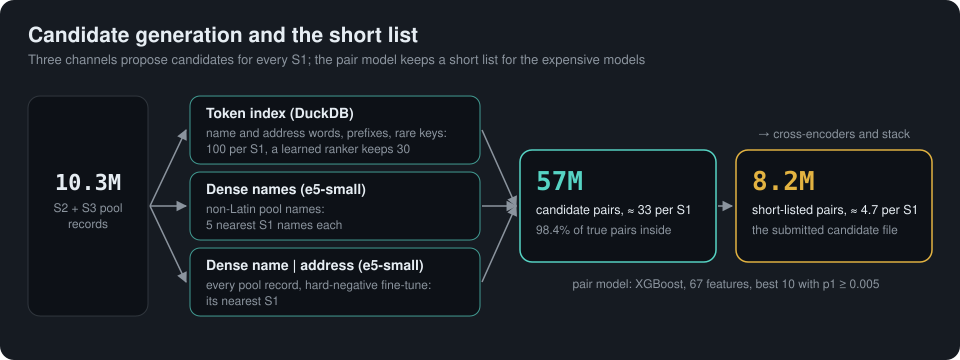

# Business Entity Resolution: multi-channel blocking, gradient-boosted matcher, cross-encoder and consensus stacking

Solution of team Nooglers for the Amazon ML Challenge 2026 (Business Entity Resolution). For every Source 1 (S1) business record it
predicts the matching Source 2 / Source 3 (S2/S3) records and writes the candidate set the model scored. Score: macro F_0.5 over S1
entities. Everything is derived from the provided training and test TSV files only: no external data, APIs, registries or geocoding.
Pretrained models are used only as open-source encoders (`intfloat/multilingual-e5-small` and `-base`, MIT, 118M and 278M parameters, downloaded once
from Hugging Face; see "Licences"), fine-tuned here on the training pairs.

## Pipeline

<p align="center"></p>


1. **prepare** (`stages/prepare.py`, `text.py`): rule-based text normalisation (HTML entities, Latin-only accent stripping, digit-for-letter
   repair, DBA/alias and domain splitting, legal forms in their own field, country-specific address abbreviations incl. France,
   offline romanisation of non-Latin scripts with anyascii), Parquet output, label table.
2. **sample** (`stages/sample.py`): 250,000 training S1 as queries with 5 folds grouped by S1 (the full S2+S3 pool is kept, so competition
   between S1 entities matches test time). `split.py` fixes the locked 150,000-S1 holdout used for all evaluation.
3. **Candidate generation**, the union of three channels merged into the candidate shards:
   - `block.py` + `prune.py`: weighted token index in DuckDB over the 10.3M pool records (name words, address words, 5-character prefixes,
     composite rare-token keys; tokens with document frequency above 800 ignored), 100 raw candidates per S1, a learned first-stage
     ranker keeps the best 30;
   - `dense.py`: multilingual encoder over names; each non-Latin pool name gets its 5 nearest S1 names;
   - `dense_all.py`: the same encoder over "name | address" of every record, fine-tuned with mined hard negatives; each pool record gets
     its nearest S1 (top 1). Together the candidates contain 98.4% of the true pairs.
4. **pairs** (`stages/pairs.py`): 67 features per pair (blocking scores, competition between S1 for the same record, name and address
   similarities, house-number and postal-code agreement, legal forms, name rarity, coverage, glued names, digit alignment,
   romanised similarities, dense cosines and ranks).
5. **train_gpu** (`stages/train_gpu.py`, `score_rest.py`): first-stage XGBoost (CUDA when available) on 850,000 S1 (the sample plus 600,000
   more), out-of-fold probabilities p1 for all of them; probabilities for the remaining train S1 come from `score_rest`.
6. **Shortlist** (`stack.shortlist`): per S1 the best 10 candidates by p1 with p1 >= 0.005 (the best one always kept). This is the set that is
   scored by the second stage and written to `candidate_pairs.tsv` (about 4.7 candidates per S1).
7. **xenc** (`stages/xenc.py`): two cross-encoders (`multilingual-e5-base` and `multilingual-e5-small`, each with a one-logit head) read both
   records of the uncertain band (p1 between 0.01 and 0.99, respectively 0.02 and 0.98) and produce the scores `xs` and `xs2`; digit runs are
   tagged so a changed digit is a visible difference. Their fitting S1 are excluded from the stack.
8. **stack** (`stages/stack.py`): second-stage XGBoost on consensus evidence: how many confident records an S1 already has per source,
   how strongly other S1 claim the same record, house-number and digit agreement with the S1's other confident records, TF-IDF cosine
   of names and addresses, edit-type (decoy) features of the names, carried first-stage features and `xs`; trained on 1.5M S1.
9. **Decision and outputs** (`predict.py`, `decision.py`): every S2/S3 record keeps only its highest-probability S1 (records have at most
   one owner in the training data), a threshold tuned out-of-fold decides, and both TSV files are written and validated.

Every S1 entity, including entities of a country never seen in training (France), gets exactly one row; an empty list means no match.

<p align="center"></p>

## Decoding (France)

<p align="center"></p>


France has no training labels and its records differ from the training countries: names are two words (city or brand plus a type word such as `club`, `ecole`, `comite`), many
businesses share a building, and the region in an address is often replaced by the department. The test predictions of the stacked model are post-processed by
`src/scripts/france/france_variants.py` with three structural rules that use only the test files and the training data's known limits:
- **Type-word swap decoys.** A pair whose core names differ by exactly one common word on each side is a decoy when the swapped-in word belongs to the country's type vocabulary. The
  vocabulary is estimated without labels from slot occupancy: an S1 has at most 5 S2 and 6 S3 matches, true copies must fit into the free slots, so their number per S1 falls to zero when the S1 is
  full, while decoys arrive at a rate that does not depend on how full it is. Words whose rate does not fall (ratio of S1 with three or more exact copies to S1 with none of at least 0.75) are type words.
- **A stricter probability cut-off for France** (0.985): the model's probabilities are over-confident there.
- **Capacities**: at most 5 S2 and 6 S3 matches per S1 in every country.

Version 8 of the decoding (rules `thrpn`, `protect`, `restore`; `src/scripts/france/france_recall.py`) keeps France's own kinds of true copies, which the
training data never shows and the model therefore scores low:
- **Protected cut-off `thrpn`** (0.995 instead of the plain 0.985): the cut-off drops only pairs that are not equal after spaced legal forms
  (`s a r l`), not initials of the S1's name, and not a noise-word copy (a word swapped into or added from `fils`, `groupe`, `services`,
  `developpement`, `and associes`: the words the true France copies inject, found without labels from their replacement rates and slot occupancy).
- **`protect`**: an S1 that the cut-off would leave with an empty list keeps its best pair (p >= 0.9); the metric is per S1, and an S1 that has a
  true match scores 0 with an empty list.
- **`restore`**: shortlisted pairs below the decision whose pool record no S1 owns are added when they are one of those copy kinds at the S1's
  own address (same house number, address similarity >= 90), within the S1's free slots. Exact names are not restored (on the labelled holdout
  such restores are 0.4% true).

## Reproduce

Requirements: Python 3.12 with `requirements.txt` (use a CUDA build of torch for the dense retrieval and cross-encoder
steps), a CUDA GPU (24 GB was used), 64 CPU cores and 256 GB RAM recommended (it also runs on smaller machines
with smaller chunk sizes, only slower), about 120 GB of scratch disk.

```bash
python -m venv .venv && source .venv/bin/activate && pip install -r requirements.txt
export BER_DATA=/path/to/dataset     # folder containing train/ and test/ (the TSV files from the challenge)
export BER_WORK=/path/to/work        # scratch and outputs
bash reproduce_final.sh   # runs every stage in order; about 6 hours on 64 vCPU + A10G
```

The outputs are `$BER_WORK/output/s17/matching_results.tsv` (leaderboard file) and `$BER_WORK/output/s17/candidate_pairs.tsv`. Validate
with the organisers' script and the bundled checker (every rule of the statement: format, one row per S1, ids exist, matches are a subset
of candidates, one owner per record, per-country statistics):

```bash
python3 utils/validate_submission.py --matching $BER_WORK/output/s17/matching_results.tsv \
    --candidate $BER_WORK/output/s17/candidate_pairs.tsv --test-dir $BER_DATA/test --check-ids
python src/scripts/check_submission.py $BER_WORK/output/s17 $BER_DATA/test
```

Parameters for every stage are in `configs/params.yaml`; run tracking (parameters, metrics, timings) goes to `$BER_WORK/runs/runs.jsonl`
and an MLflow sqlite database. `make test` runs the unit and end-to-end tests (29 tests, CPU only, on a small synthetic dataset).
`make reproduce` runs the earlier, simpler pipeline (token blocking plus first-stage model only).

## Layout

```
src/ber/                 package: text.py, config.py, decision.py, split.py, tracking.py, validate.py, synth.py
  stages/                prepare, sample, block, block_eval, prune, dense, dense_all, pairs, train_gpu, score_rest, xenc, stack, predict
src/scripts/france/      French decoding and French adaptation: france_variants.py (rule engine), france_lists.py (namesake and
                         invented-name lists), france_recall.py, france_post.py, band_kinds.py, word_swap.py, namesake_street.py,
                         frenchify.py (French-form rewrite of training records), stack_langfree.py (language-free stack features);
                         late France tools: xfz.py, xfz_decide.py, xfz_decide2.py (French-aware cross-encoder decisions),
                         excess_cells.py, glued_typeswap.py, typo_restore.py, france_student.py, pool_support_scan.py
src/scripts/stack/       score and stack tools: avg_xenc.py, xs_merge.py, stack_predict_merge.py, blend_stacks.py, reemit.py,
                         paired_models.py (paired bootstrap)
src/scripts/check_submission.py   submission checker
src/tests/               unit and end-to-end tests
configs/params.yaml      all tunables
reproduce_final.sh       the exact command sequence of the submitted model
```

## Results

Locked holdout of 150,000 training S1 that no model trained on (macro F_0.5, paired bootstrap against the previous model):

| Model | Holdout F_0.5 |
|---|---|
| first pair model with cascade blocking | 0.9565 |
| + consensus stacking, digit and TF-IDF features | 0.9677 |
| + name dense channel | 0.9708 |
| + name and address dense channel (first stage 0.9757) and stack | 0.9832 |
| + cross-encoder score, more training data, deeper stack (`s15`) | 0.9894 |
| + stronger cross-encoder (e5-base), e5-small as second feature, refined competition, first stage on 850k S1 (`s17`, portal 0.981) | 0.9903 |
| + e5-base on every short-listed pair (`s22`), symmetric two-seed e5-base (`s27`) | 0.99054, 0.99063 |
| + Qwen3-0.6B cross-encoder band score (`s29`) | **0.99088** |

**Submitted file:** `v8w_s29_FIN` = `s29` + France decoding version 8 (`france_variants.py` rules `typeswap`, `thrpn:0.9999`, `legalx`, the namesake
and coined-alias lists from `france_lists.py`, `protect`, `restore`, caps); public leaderboard **0.987745**. `reproduce_final.sh` steps 8c and 9.

<p align="center"></p>

Test run: about 4.7 candidates per S1 (57M candidate pairs before the shortlist), about 94% of S1 receive at least one match. France has no
training labels; its behaviour is only checked through the model's own probabilities and output statistics.

## Licences and constraints

Models: XGBoost (Apache-2.0) for both matching stages; `intfloat/multilingual-e5-small` (MIT, 118M parameters) as encoder for dense
retrieval and `intfloat/multilingual-e5-small` and `intfloat/multilingual-e5-base` (MIT, 278M parameters) and `Qwen/Qwen3-0.6B` (Apache-2.0) as cross-encoder bases. Libraries: numpy, scikit-learn, pandas (BSD-3), polars, duckdb, rapidfuzz, pyyaml,
mlflow, pytest (MIT/Apache-2.0), anyascii (ISC), torch (BSD-3), transformers (Apache-2.0). All far below 8B parameters. The abbreviation and
legal-form tables in `text.py` are hand-written string rules, not external data lookups; the encoder weights are the only downloaded
artifact and no data of the challenge is sent anywhere.
